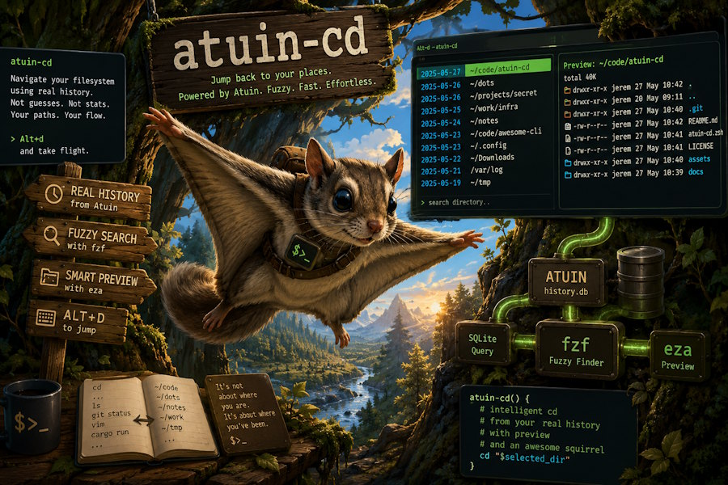

# atuin-cd


----------------

Disclaimer: vibecoded but cool.

------------

A tiny Zsh / Oh My Zsh plugin to jump back to directories from your
Atuin history.

`atuin-cd` reads the `cwd` values from Atuin's SQLite database, sorts
them by most recent visit, displays them through `fzf`, shows a preview
with `eza`, and `cd`s into the selected directory.

The idea is simple: your shell already knows where you've been, so
jumping back there should be instant.

## Features

-   Uses your Atuin history as the source of truth.
-   One entry per directory, sorted by most recent visit.
-   Fuzzy search with `fzf`.
-   Directory preview powered by `eza`.
-   Automatically adapts the preview layout to the terminal size.
-   Displays `~` instead of `$HOME` for readability.
-   Returns the real absolute path internally.
-   Keyboard shortcut (`Alt+d`) via a ZLE widget.



## Requirements

-   zsh
-   Atuin
-   sqlite3
-   fzf
-   eza

## Installation (Oh My Zsh)

Clone the repository:

``` bash
git clone https://github.com/jerem-punk/atuin-cd \
  ${ZSH_CUSTOM:-~/.oh-my-zsh/custom}/plugins/atuin-cd
```

Enable the plugin:

``` zsh
plugins=(
  git
  fzf
  atuin-cd
)
```

Reload your shell:

``` bash
source ~/.zshrc
```

## Manual installation

Clone the repository anywhere:

``` bash
git clone https://github.com/jerem-punk/atuin-cd ~/code/atuin-cd
```

Source it from your `.zshrc`:

``` zsh
source ~/code/atuin-cd/atuin-cd.plugin.zsh
```

## Usage

Press:

``` text
Alt+d
```

Select a directory and press Enter.

You can also invoke it manually:

``` zsh
atuin-cd
```

## How it works

The SQLite query generates three tab-separated fields:

1.  Last visit date (colored)
2.  Readable directory (`~` instead of `$HOME`)
3.  Real absolute directory

`fzf`:

-   displays fields 1 and 2,
-   searches only field 2,
-   returns only field 3.

This avoids any parsing with `cut`, `sed` or `awk` after selection.

## Configuration

By default, the plugin uses:

``` text
~/.local/share/atuin/history.db
```

Override it if needed:

``` zsh
export ATUIN_DB=/path/to/history.db
```

## Default key binding

``` text
Alt+d
```

The binding invokes the `atuin-cd-widget` ZLE widget.

## License

MIT
